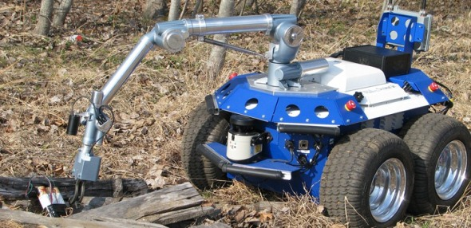

# Study-and-simulation-of-5DOF-arm

Introduction: 

Kinematics is the description of motion without regard to the forces that cause it. It deals with the study of position, velocity, acceleration, and higher derivatives of the position variables.   

The kinematics solutions of any robot manipulator are divided into two solutions, the first one is the solution of Forward kinematics, and the second one is the inverse kinematics solution. Forward kinematics will determine where the robot’s manipulator hand will be if all joints are known. Where the inverse kinematics will calculate what each joint variable must be if the desired position and orientation of end-effector is determined. Hence, Forward kinematics is defined as transformation from joint space to Cartesian space where as Inverse kinematics is defined as transformation from Cartesian space to joint space.

